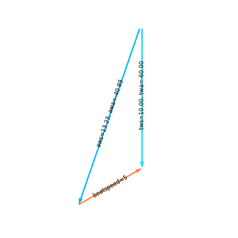
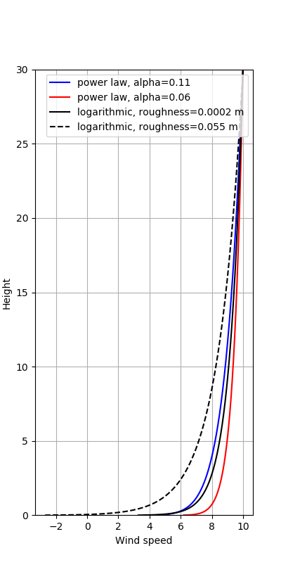
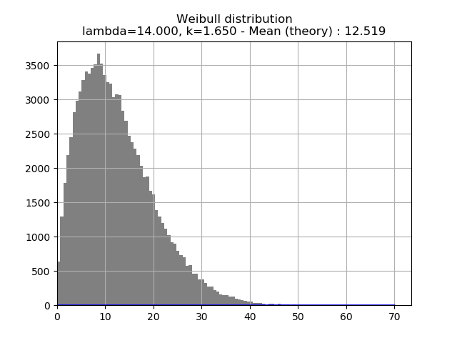

ydeos_aerodynamics
==================

.. image:: https://travis-ci.org/ydeos/ydeos_aerodynamics.svg?branch=main
    :target: https://travis-ci.org/ydeos/ydeos_aerodynamics

.. image:: https://app.codacy.com/project/badge/Grade/8c48da057dc242e3af8739eddcb0a5e8
    :target: https://www.codacy.com/gh/ydeos/ydeos_aerodynamics/dashboard?utm_source=github.com&amp;utm_medium=referral&amp;utm_content=ydeos/ydeos_aerodynamics&amp;utm_campaign=Badge_Grade

.. image:: https://coveralls.io/repos/github/ydeos/ydeos_aerodynamics/badge.svg?branch=main
    :target: https://coveralls.io/github/ydeos/ydeos_aerodynamics?branch=main

**ydeos_aerodynamics** is a collection of aerodynamics models. It is mainly aimed at sailboats but the windage module applies to all kinds of ships.

- Sails force model
- True to/from apparent wind speed and angle computation
- Windage model (hull, mast)
- Wind vertical profile and wind speed distribution model (Weibull)
- Air characteristics

Install
-------

.. code-block:: shell

   git clone https://github.com/ydeos/ydeos_aerodynamics
   cd ydeos_aerodynamics
   python setup.py install

Examples
--------

See the examples_ folder.

   Wind triangle (apparent_example.py_)

   Vertical wind profile (profile_example.py_)

   Wind speed distribution (weibull_example.py_)

.. _examples: https://github.com/ydeos/ydeos_aerodynamics/tree/main/examples
.. _apparent_example.py: https://github.com/ydeos/ydeos_aerodynamics/tree/main/examples/apparent_example.py
.. _profile_example.py: https://github.com/ydeos/ydeos_aerodynamics/tree/main/examples/profile_example.py
.. _weibull_example.py: https://github.com/ydeos/ydeos_aerodynamics/tree/main/examples/weibull_example.py

Contribute
----------

Please open an issue if you find a bug or if you come up with ideas about how to improve the project.

Then: fork, feature branch and open a pull request. Feel free to contribute!
